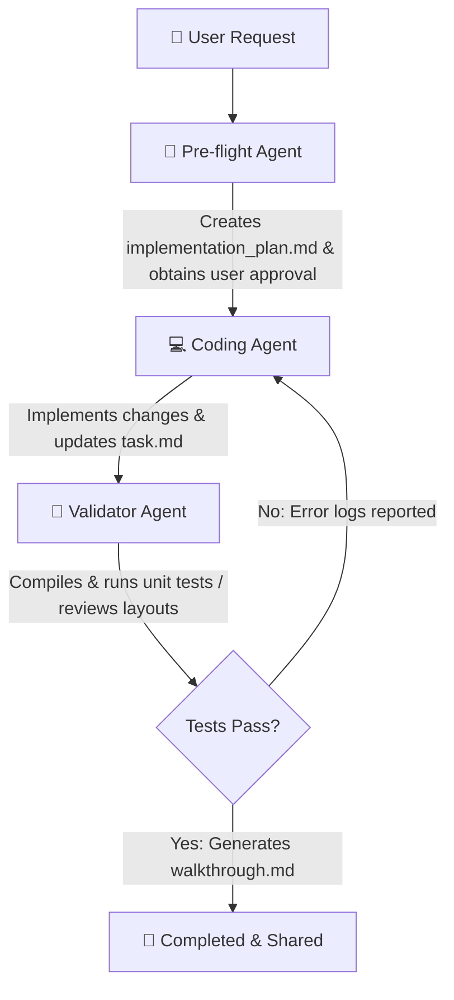

# 🚀 Feature-Building Workflow Guide

Welcome! This guide defines the multi-agent workflow designed for **Antigravity Gemini** to implement, verify, and validate new features or bug fixes in the **Unity Asset Viewer Extension** monorepo.

---

## 🏛️ Pipeline Overview

To ensure extreme layout accuracy, strict environment isolation, and clean repository state, feature requests are processed through three specialized agent roles:

---

## 🔎 Phase 1: Pre-flight (Analysis & Design)

The **Pre-flight Agent** focuses entirely on gathering context, aligning with repository guidelines, and producing a highly accurate design plan.

### 📝 Objectives
- Assess the requested changes against [ARCHITECTS.md](file:///c:/Users/User/Documents/1_Projects/UnityAssetViewerExtension/ARCHITECTS.md).
- Validate the local environment health (git status, packages, branches).
- Establish exact file modifications/creations required and dependencies.

### 🛠️ Execution Protocol
1.  **Sanity Checks**:
    *   Verify git is on a clean branch: `git status`.
    *   Check for uncommitted files.
2.  **Architecture Alignment**:
    *   Review `ARCHITECTS.md` for specific package constraints (e.g., vanilla TS for `core-parser` and `core-renderer` with no environment-specific imports).
    *   Examine existing packages to locate optimal hooks or integration points.
3.  **Design Plan**:
    *   Write a comprehensive design to the `implementation_plan.md` artifact.
    *   Indicate any potential risks (e.g., performance impact on the rendering pipeline, violating isolated package boundaries).
    *   Outline automated and manual verification strategies.
4.  **Checkpoint**: Set `RequestFeedback: true` on `implementation_plan.md` and present the plan to the user. **Wait for explicit user approval before proceeding to the coding phase.**

---

## 💻 Phase 2: Coding (Implementation)

Once the design plan is approved, the **Coding Agent** performs the raw implementation, adhering to strict coding and styling guidelines.

### 📝 Objectives
- Carry out edits exactly as approved in `implementation_plan.md`.
- Adhere to the codebase's strict formatting and separation of concerns.
- Keep comments and docstrings intact.

### 🛠️ Execution Protocol
1.  **Task Tracker Setup**:
    *   Create or update the `task.md` artifact in the brain folder listing the component-level tasks needed for the implementation.
2.  **Code Edits**:
    *   Implement logic with appropriate TypeScript types, CSS, or HTML structures.
    *   **Strict rule**: `packages/core-parser` and `packages/core-renderer` must **never** import any browser-specific APIs (`chrome.*`) or VS Code specific APIs (`vscode`).
    *   Keep CSS designs highly premium, utilizing variables and smooth transitions. Avoid hardcoded values where possible.
3.  **Documentation**:
    *   Preserve existing docstrings and comments.
    *   Document new complex functions or calculations clearly.
4.  **Progress Tracking**:
    *   Update `task.md` regularly, marking items as `[/]` (in-progress) or `[x]` (completed).
5.  **Checkpoint**: Inform the parent agent that the code implementation is complete, highlighting the file changes and referring to the updated `task.md`.

---

## 🧪 Phase 3: Validation (Verifying & Summarizing)

The **Validator Agent** performs rigorous quality checks, compiling the workspaces, executing test suites, and formatting the final walkthrough.

### 📝 Objectives
- Compile the entire monorepo without syntax or compilation errors.
- Ensure all unit tests pass seamlessly.
- Verify layout calculations and design accuracy.
- Prepare a comprehensive post-implementation summary.

### 🛠️ Execution Protocol
1.  **Build Workspaces**:
    *   Run `npm run build` to verify standard TypeScript compilation and bundle generation.
2.  **Run Tests**:
    *   Run `npm test` (or the automated validation utility script) to execute the test suite.
3.  **Analyze Errors**:
    *   If compilation or tests fail, capture the exact logs, diagnose the problem, and return the findings to the Coding phase for correction. Do not attempt to hand over broken code.
4.  **Documentation & Walkthrough**:
    *   Create or update `walkthrough.md` in the brain folder.
    *   Provide a list of files modified, what was tested, and command outputs.
    *   Embed visual screenshots (if applicable) or verification logs to demonstrate correct execution.
5.  **Checkpoint**: Provide a concise summary of the successful validation to the user, linking them to the complete `walkthrough.md`.
